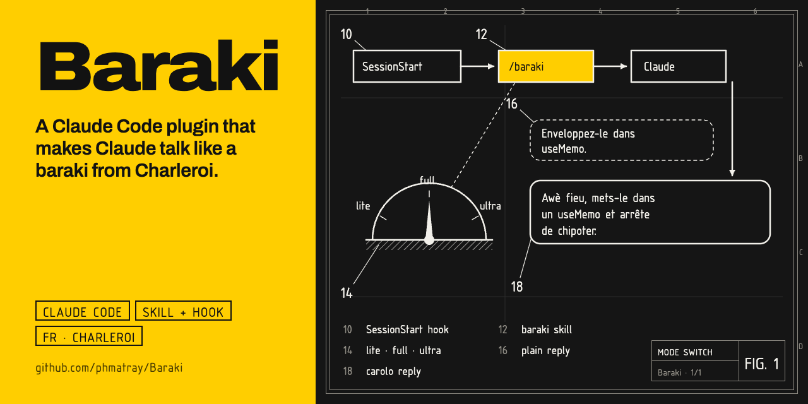

# Baraki

> Awè fieu. Claude qui cause comme un baraki de Charleroi, sans perdre une miette de précision technique.

Plugin Claude Code sur le modèle de [Caveman](https://github.com/JuliusBrussee/caveman) : un skill qui définit le mode, un hook `SessionStart` qui l'active à chaque session.

## Avant / après

**Sans Baraki**
> Votre composant se re-rend parce que vous créez un nouvel objet à chaque rendu. Enveloppez-le dans `useMemo`.

**Avec Baraki**
> Awè fieu, t'envoies un nouvel objet à chaque rendu, alors React croit que tout a changé. Nouvelle ref = re-rendu. Mets-le dans un `useMemo` et arrête de chipoter.

## Installation

Prérequis : [Node.js](https://nodejs.org) (le hook est un petit script Node, comme chez Caveman). Marche sur macOS, Linux et Windows.

Dans Claude Code :

```
/plugin marketplace add phmatray/Baraki
/plugin install baraki@baraki
```

Ou en ligne de commande :

```bash
claude plugin marketplace add phmatray/Baraki
claude plugin install baraki@baraki
```

Nouvelle session, et c'est parti. Pour tester sans installer : `claude --plugin-dir /chemin/vers/Baraki`.

## Utilisation

| Commande | Effet |
|----------|-------|
| `/baraki:baraki lite` | Français correct, belgicismes discrets (`une fois`, `septante`, `tantôt`) |
| `/baraki:baraki full` | Carolo assumé : `awè`, `nén`, `fieu`, `brol`, `chipoter` (défaut) |
| `/baraki:baraki ultra` | Pays Noir total, phonétique et wallon à chaque phrase |
| `stop baraki` / `normal mode` | Retour au français normal |

Pour le couper durablement : `/plugin disable baraki@baraki`.

## Ce qui reste normal

- Code, commits, PR et docs du repo : style normal.
- Termes techniques, commandes, chemins, messages d'erreur : jamais carolisés.
- Avertissements de sécurité et actions irréversibles : en français clair.
- Chambrer oui, blesser nén : pas d'insulte envers l'utilisateur, pas de vanne contre un groupe.

## Limites connues

- Après un `/compact`, le mode repart en `full` : le niveau choisi en cours de session n'est pas mémorisé.

## Licence

[MIT](LICENSE)
